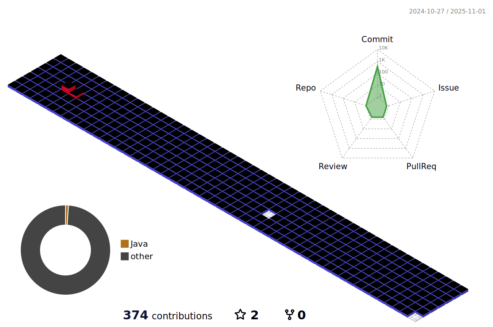

<header>

<header> 
 ssyysskywalker@gamil.com 
 🔠꿈꾸는 개발ì, 신승연ì…니다. 강력한 ê³ ì–‘ì´ì˜ ì˜ì§€, ì¸ìƒì ì¸ 닉네ì„ì´ì§€ë§Œ 본명으로 ë¶ˆëŸ¬ì£¼ì…”ë„ ì¢‹ìŠµë‹ˆë‹¤.   
 🥕 결과도 중요하지만, 무엇보다 '과정 속에서 얻는 깨달음'을 좋아해요 

<h1>✔️ Tech STACKS</h1>

 	 
	
	
 	 
 	 
 	 
	
	
	
	 
	
	 
	
	 
	
  
<h1>✔️ Tools & Collaboration STACKS</h1>

	
   	
   	
	
	 
	
	
	
	
 	 
   	
   	
    	
    	
	

  

<!--  -->

	

		

			
		

		

		
📏Math

		<li>Studying algebra ten hours a week</li>
		<li>Solving algorithm practice in baekjoon online judge more than once a day</li>
		<li>Leading Coding test study group which is regular employee's study in use BaekJoon and Programmers</li>
	

	

		
🎇Vision

		<li>One day, i'll study quantum computing</li>
		<li>One day, i'll be a trustworthy engineer and a co-worker</li>
	

	

